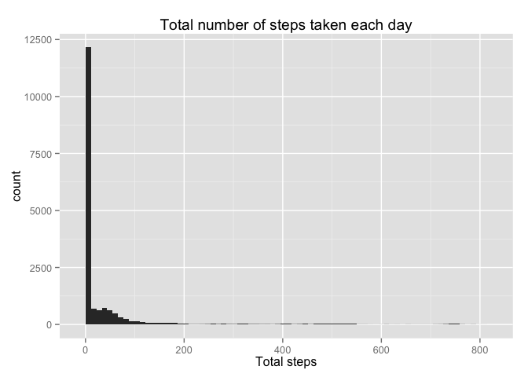

# Reproducible Research: Peer Assessment 1

####Loading and preprocessing the data
Loading the library ggplot2 we have used to draw the plots


```r
library(ggplot2)
dades <- read.csv("activity.csv")
dadesNetes <- na.omit(dades)
dadesPerDay <- dadesNetes[,1:2]
```

####What is mean total number of steps taken per day?
We first calculate the total number of steps taken per day

```r
totalSteps <- aggregate(steps ~ date, dadesPerDay, FUN = sum)
```

The total number of steps taken per day are shown in the following plot

```r
ggplot(totalSteps, aes(x=steps)) + geom_histogram(binwidth=1000) + 
    ggtitle("Total number of steps taken each day") +  xlab("Total steps")    
```

 

What is mean total number of steps taken per day?

```r
options("scipen"=100)
meanSteps <- round(mean(totalSteps$steps), digits=2)
medianSteps <- median(totalSteps$steps)
```

The mean and median of the total number of steps taken per day are:  
- mean:  10766.19    
- median: 10765

####What is the average daily activity pattern?
Make a time series plot of the 5-minute interval (x-axis) and the average number of steps taken, averaged across all days (y-axis).


```r
dadesInterval <- dadesNetes[,c("steps", "interval")]
totalSteps <- aggregate( steps  ~ interval , data=dadesInterval, FUN = mean)

myplot <- qplot(interval, steps, data=totalSteps, geom="line", main="Average daily activity", ylab="Average number of steps") 
print(myplot)
```

 

```r
maxInterval <- subset(totalSteps, totalSteps[,"steps"] == max(totalSteps$steps))$interval
maxIntervalTime <- format(strptime(sprintf("%04d", maxInterval), format="%H%M"), format="%H:%M")
```

The 5-minute interval, on average across all the days in the dataset, containing the maximum number of steps is 835 corresponding to 08:35    

####Imputing missing values
I have filled  all of the missing values in the dataset assigning mean for that 5-minute interval.


```r
meanStepsInterval <- totalSteps 
names(meanStepsInterval)[names(meanStepsInterval)=="steps"] <- "stepsMean"

totesDades <- merge(dades, meanStepsInterval, by=c("interval"),  sort=F)
totesDades$steps[is.na(totesDades$steps)] <- totesDades$stepsMean[is.na(totesDades$steps)]
```

Make a histogram of the total number of steps taken each day 

```r
ggplot(totesDades, aes(x=steps)) + geom_histogram(binwidth=11) + ggtitle("Total number of steps taken each day") +  xlab("Total steps")   
```

 

```r
meanSteps <- round(mean(totesDades$steps), digits=2)
medianSteps <- median(totesDades$steps)
```

There is a high impact of imputing missing data. The mean and median of the total number of steps taken per day without missing values are:  
- mean:  37.38    
- median: 0

####Are there differences in activity patterns between weekdays and weekends?
I have created a new factor variable in the dataset with two levels: "weekday" and "weekend" indicating whether a given date is a weekday or weekend day.

Make a panel plot containing a time series plot (i.e. type = "l") of the 5-minute interval (x-axis) and the average number of steps taken, averaged across all weekday days or weekend days (y-axis). 

There is a slight difference between the activity patterns between weekdays and weekdends that is that the starting time to make activity during weekends is a little bit later than in weekdays. The final time is also later during weekends than weekdays.


```r
library(plyr)
totesDades$date <- as.Date(totesDades$date, "%Y-%m-%d")
grWeekend<-c("Saturday", "Sunday")
totesDades$Weekday <- with(totesDades, ifelse( weekdays(totesDades$date) %in% grWeekend, "Weekend", "Weekday"))

totesDades <- ddply(totesDades,  c("interval", "Weekday"), summarize, stepsMean=mean(steps))

ggplot(data = totesDades, aes(x = interval, y = stepsMean))  +
    geom_line(color = "red") + facet_grid(Weekday ~ .) +  xlab("Time of the day") +
    scale_x_discrete(breaks = c("0","500","1000","1500","2000","2355"), labels=c("0:00AM", "5:00AM", "10:00AM", "3:00PM", "8:00PM","11:55:PM"))
```

 
